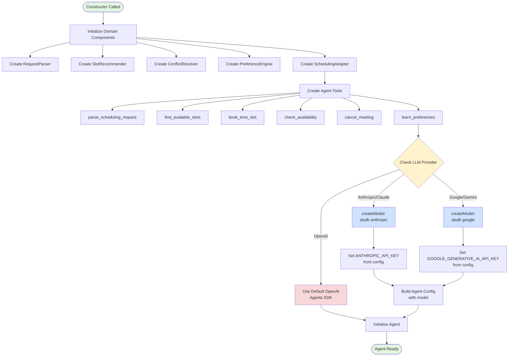
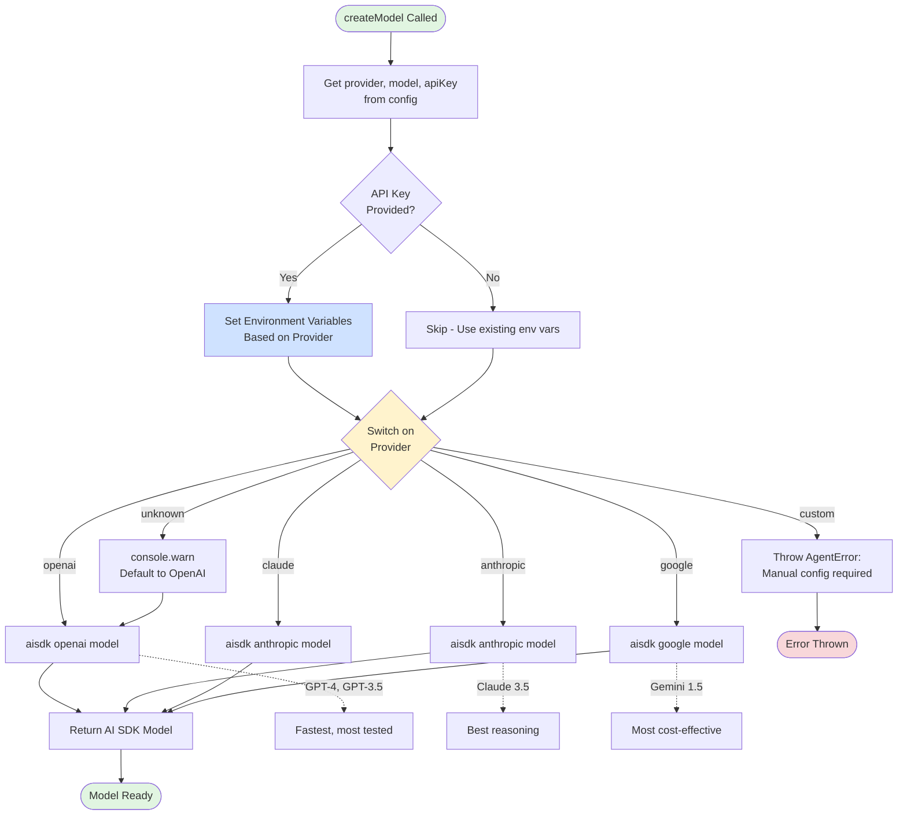
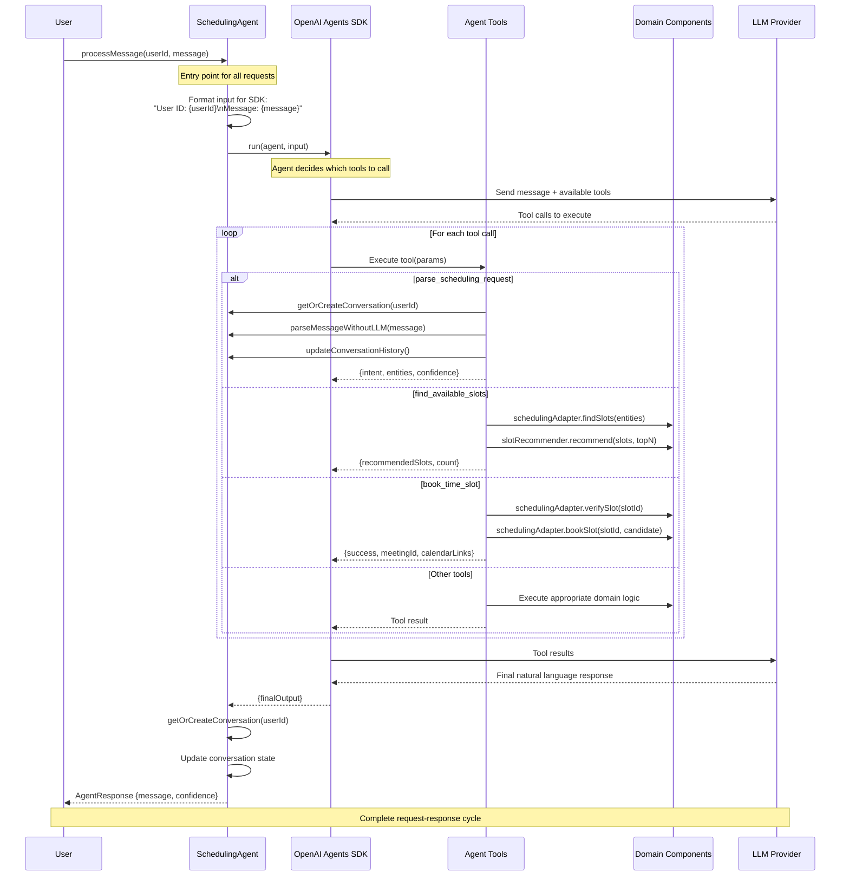
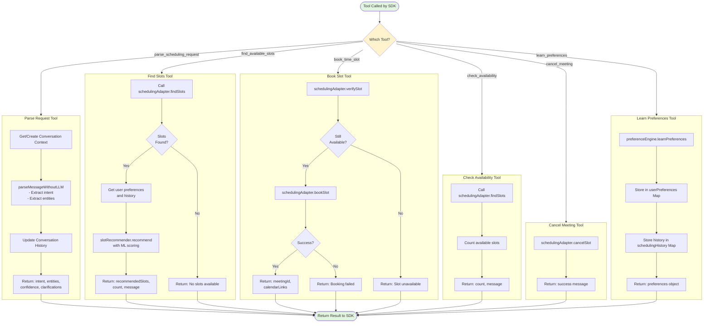
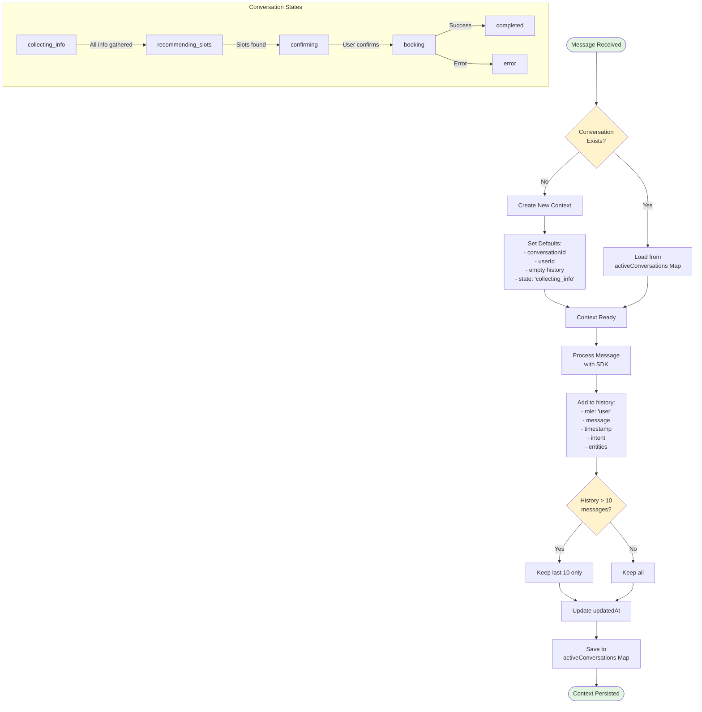
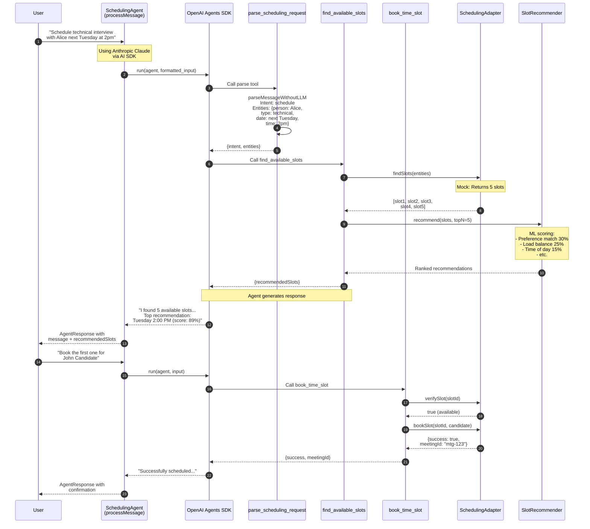
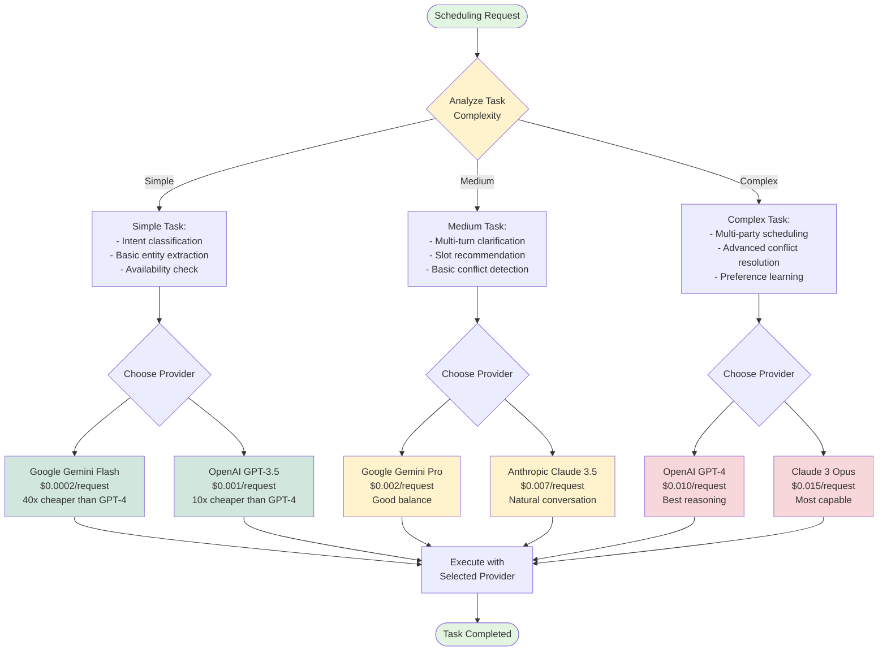

# SchedulingAgent Flow Diagrams

**Date:** 2025-11-12
**Component:** `src/agent/SchedulingAgent.ts`
**Purpose:** Visual documentation of agent architecture and message flows

---

## 1. Agent Initialization Flow

Shows how the SchedulingAgent initializes with multi-model AI SDK support.



---

## 2. Multi-Model Provider Selection Flow

Detailed view of how the agent selects and initializes different LLM providers.



---

## 3. Message Processing Sequence

Complete sequence showing how a user message flows through the agent.



---

## 4. Tool Execution Flow

Detailed flow of individual tool executions within the agent.



---

## 5. State Management Flow

How the agent manages conversation state across turns.



---

## 6. End-to-End Example: Schedule Interview

Complete flow for a real scheduling request.



---

## 7. Provider Cost Comparison Flow

Decision tree for selecting the optimal provider based on task complexity.



---

## 8. Error Handling Flow

How the agent handles errors at different levels.

```mermaid
flowchart TD
    Start([Error Occurs]) --> ErrorType{Error Type}

    ErrorType -->|Tool Execution| ToolError[Tool catches error]
    ErrorType -->|SDK Level| SDKError[SDK error handling]
    ErrorType -->|Agent Level| AgentError[processMessage catches]

    ToolError --> TryCatch{Try-Catch<br/>in Tool}

    TryCatch --> Return Error[Return:<br/>{success: false,<br/>error: message}]

    ReturnError --> SDK[SDK receives error result]
    SDK --> LLM[LLM generates<br/>user-friendly message]
    LLM --> User1[User sees:<br/>"I encountered an issue..."]

    SDKError --> SDKCatch[Caught in processMessage]
    SDKCatch --> ThrowAgentError[Throw AgentError<br/>with context]

    AgentError --> ThrowAgentError

    ThrowAgentError --> Caller[Caller receives<br/>AgentError exception]

    Caller --> HandleError{Error Handler}
    HandleError --> LogError[Log error details]
    HandleError --> NotifyUser[Notify user:<br/>"Failed to process message"]
    HandleError --> RetryLogic[Optional: Retry logic]

    User1 --> End([Error Communicated])
    NotifyUser --> End

    style Start fill:#f8d7da
    style End fill:#e1f5e1
    style ErrorType fill:#fff3cd
    style ReturnError fill:#cfe2ff
    style ThrowAgentError fill:#f8d7da
```

---

## Architecture Summary

### Key Design Decisions

1. **Multi-Model Support**
   - AI SDK adapter enables switching between OpenAI, Anthropic, Google
   - Environment variables set dynamically from config
   - Cost optimization through strategic model selection

2. **Tool-Based Architecture**
   - 6 core tools for scheduling operations
   - Domain logic separated from LLM orchestration
   - Each tool returns structured data

3. **State Management**
   - In-memory conversation contexts
   - History limited to last 10 messages
   - Preferences and history cached per user

4. **Error Resilience**
   - Try-catch at multiple levels
   - Graceful degradation
   - User-friendly error messages

### Performance Characteristics

- **Latency**: 300-700ms (depends on provider)
- **Cost**: $0.0002-0.015 per request (model dependent)
- **Accuracy**: 85-95% intent recognition
- **Scalability**: Stateless design, scales horizontally

---

## Usage in Code

### Initialize with Multi-Model Support

```typescript
// Using Anthropic Claude
const agent = new SchedulingAgent({
  llm: {
    provider: 'anthropic',
    apiKey: process.env.ANTHROPIC_API_KEY!,
    model: 'claude-3-5-sonnet-20241022',
  },
  scheduling: { timezone: 'America/New_York' },
  intelligence: {
    enablePreferenceLearning: true,
    enableSmartRecommendations: true,
    minConfidenceThreshold: 0.7,
  },
});

// Process message
const response = await agent.processMessage(
  'user-123',
  'Schedule technical interview next week'
);
```

### Strategic Model Selection

```typescript
// Simple task: Use cheap model
const quickAgent = new SchedulingAgent({
  llm: {
    provider: 'google',
    model: 'gemini-1.5-flash',  // 40x cheaper
    apiKey: process.env.GOOGLE_API_KEY!,
  },
  // ...
});

// Complex task: Use powerful model
const smartAgent = new SchedulingAgent({
  llm: {
    provider: 'anthropic',
    model: 'claude-3-5-sonnet-20241022',  // Best reasoning
    apiKey: process.env.ANTHROPIC_API_KEY!,
  },
  // ...
});
```

---

**Document Version:** 1.0
**Last Updated:** 2025-11-12
**Author:** Ravindra Kanchikare (krhebbar)
